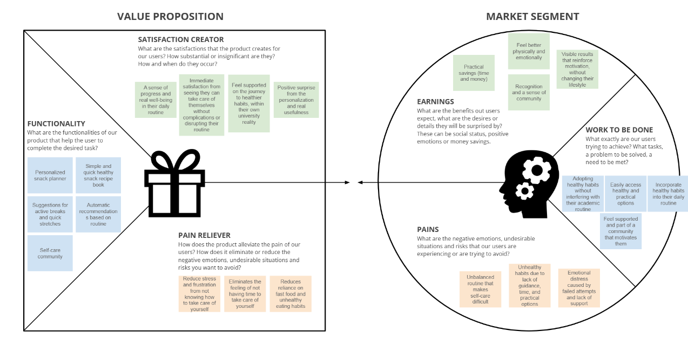
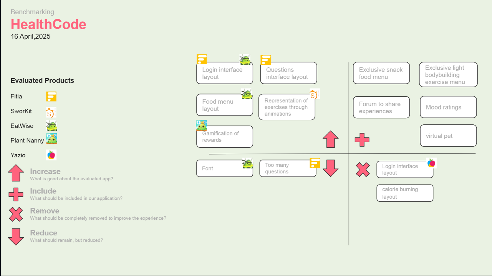
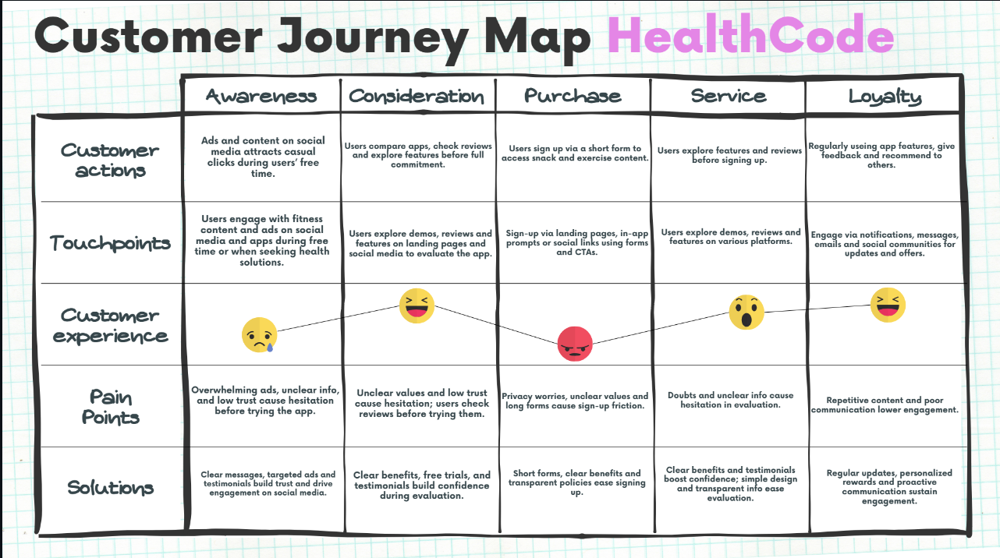
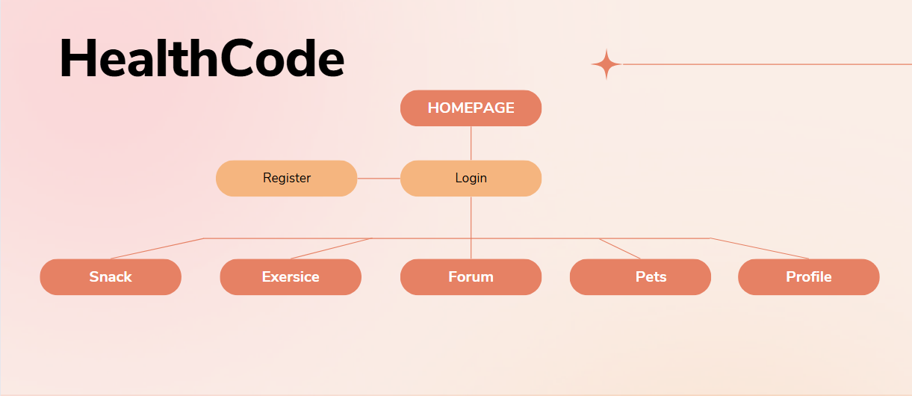
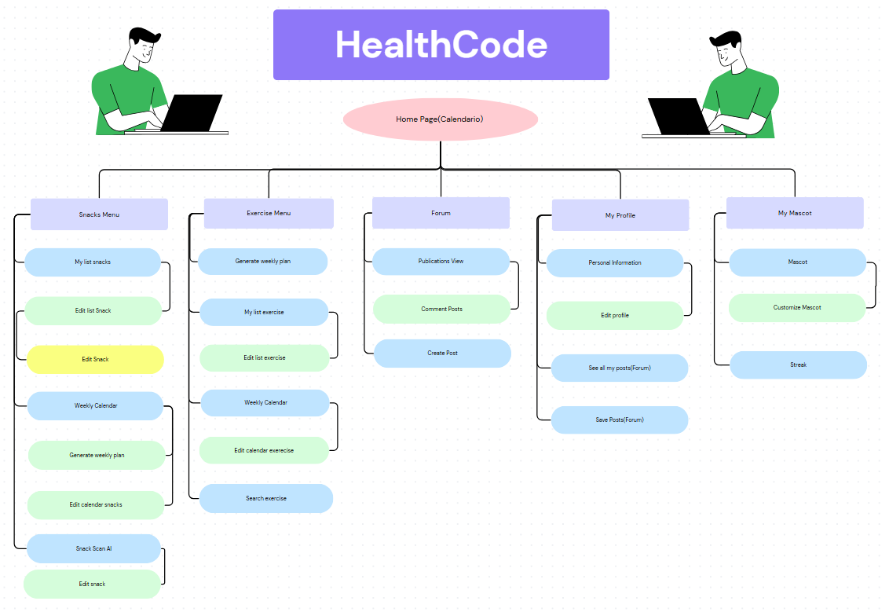
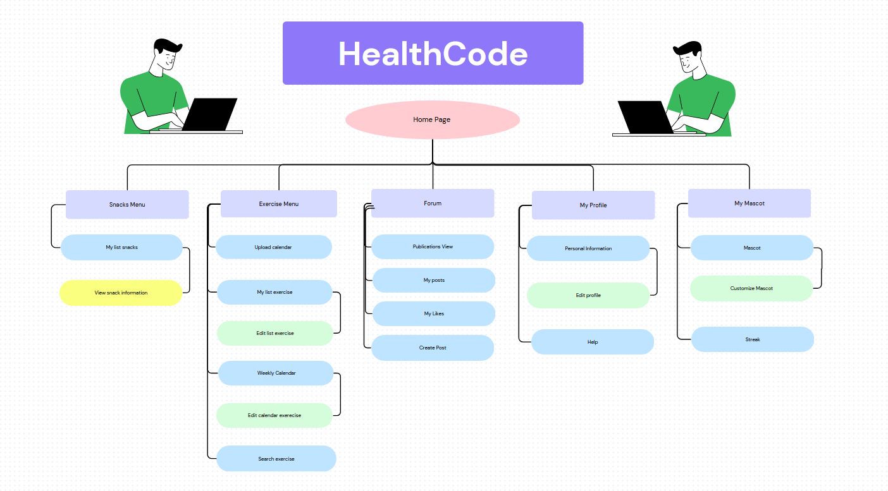

# 💚  HealthCode UXD (WIP)

User experience study for **HealthCode App** — a mobile application that promotes healthy habits through nutrition tips, brief exercises, and daily motivation.

---

## 📚 Index

1. [Introduction](#1-introduction)
2. [Team](#2-team)
3. [Strategy](#3-strategy)
4. [Solutions Scope](#4-solutions-scope)
5. [Benchmark](#5-benchmark)
6. [Customer Journey Map](#6-customer-journey-map)
7. [Navigation](#7-navigation)
   - [7.1. Initial Approach](#71-initial-approach)
   - [7.2. Improved Navigation](#72-improved-navigation)
   - [7.2.1 Improved Navigation (Final)](#721-improved-navigation-final)
8. [Wireframes](#8-wireframes)
9. [Mockups](#9-mockups)
   - [9.1. Initial Approach](#91-initial-approach)
   - [9.2. Improved Mockups](#92-improved-mockups)
10. [Heuristica](#10-heuristica)

---

## 1. Introduction

Today, maintaining a healthy lifestyle has become an increasing challenge, especially for those facing demanding schedules, long hours in front of the computer, and constant academic pressure. This situation is particularly common among university students in technical fields like Computer Engineering, who often neglect their physical and emotional well-being due to lack of time, guidance, or practical alternatives.

HealthCode emerges as a response to this issue, aiming to facilitate the adoption of healthy habits without disrupting the university routine. The application focuses on two core pillars: access to healthy, quick, and easy-to-prepare snacks, and the incorporation of brief stretching exercises that can be performed anywhere and at any time during the day.

With personalized recommendations, automated suggestions, and a supportive community space, HealthCode seeks to naturally integrate into the daily lives of many students, helping them improve their well-being in a realistic, accessible, and sustainable way.

## 2. Team

Sebastián Aliante - Diseñador 

Ignacio Morales - Analista

Luis Contreras - Expositor

Benjamin Cruzado - Diseñador

Paolo Paredes - Jefe de proyecto

## 3. Strategy

In The Elements of User Experience, the first level in user-centered design is the strategy plane. This plane focuses on defining both the business objectives and the real needs of the users, establishing a solid foundation for product development.

In this context, we use the Value Proposition Canvas as a key tool for developing this stage. Through this framework, we identify what users expect to gain from our application, what frustrations they wish to avoid, and what tasks they are trying to accomplish in their daily lives. In this way, we align our solution with the users’ goals and motivations, ensuring that the experience offered fits their habits, time availability, and challenges within the university environment.

## 4. Solutions Scope

HealthCode is designed specifically for university students in technology-related fields, such as Computer Engineering, who seek to adopt healthier habits within their demanding academic schedules. The application serves users with varying levels of experience in nutrition and physical activity, offering practical and accessible solutions tailored to their needs. HealthCode provides personalized snack plans featuring quick, healthy recipes, along with guided stretching exercises that require minimal time and space. Users can monitor their progress and benefit from automated recommendations that adapt to their individual routines. Moreover, the app fosters a supportive community that motivates and accompanies users throughout their journey toward improved well-being. In summary, HealthCode is a comprehensive and user-centered tool that enables technology students to care for their health effectively without compromising their studies.

## 5. Benchmark

To design an application that truly meets the needs and expectations of students in technology-related fields, it is essential to conduct a thorough analysis of existing solutions in the market, especially those focused on healthy habits and well-being for similar audiences. This process, known as benchmarking, allows us to identify both the limitations and successful aspects of these applications, with the goal of strategically integrating them into HealthCode.

By evaluating competing applications, we can learn from their strengths and weaknesses, avoid common mistakes, and adopt proven features that add value. This provides us with a clear understanding of current market demands and user preferences, which is key to designing a superior experience tailored to the university context.

Ultimately, this comparative analysis offers valuable insights to optimize HealthCode’s development, ensuring the application stands out among alternatives and effectively fulfills user expectations.

## 6. Customer Journey Map
The Customer Journey Map is a visual tool that helps understand and analyze the user’s experience throughout their interaction with the HealthCode application. This map outlines the different stages users go through, from discovering the app to ongoing use, identifying emotions, motivations, touchpoints, and potential obstacles at each phase.

The main goal of this mapping is to gain deep insight into users’ needs and expectations to design a seamless, satisfying, and motivating experience. By identifying opportunities for improvement and key moments of interaction, the Customer Journey Map guides the development of features and strategies that maximize value delivery and user engagement with healthy habits within their university routine.

## 7. Navigation
Within the field of user experience design, the sitemap serves as a fundamental artifact connected to the element of Information Architecture, which is part of the Structure plane. Unlike visual interface designs, a sitemap outlines the hierarchical organization and relationships between all the pages or sections of a website or digital system. This clear representation of content structure is essential for planning how information is grouped and accessed.

By providing a comprehensive overview of the entire system’s content, sitemaps help UX designers ensure that users can navigate intuitively and efficiently. This, in turn, enhances usability and reduces cognitive load by making it easier for users to find relevant information. Therefore, the sitemap plays a crucial role in bridging user needs and system capabilities, laying a solid foundation for subsequent design stages such as navigation design and interface layout.

### 7.1. Initial Approach

### 7.2. Improved Navigation

### 7.2.1 Improved Navigation (Final)
Based on the feedback from our teammates, teaching assistants, and professor, we decided to change the sitemap of our application HealthCode. This change was made because our app has a more specialized focus on tracking strength training exercises and also offers snack recommendations.

## 8. Wireframes
At the core of the Skeleton plane lies the need to organize interface elements for optimal usability and navigation. Wireframes fulfill this role by providing simplified, black-and-white layouts that map out where buttons, menus, input fields, and content will appear on each screen. This step focuses on structure rather than style, ensuring that all functional components are logically arranged and accessible.

Wireframes help designers and stakeholders visualize the flow of interactions and the hierarchy of information without distractions from colors or images. By doing so, they enable early testing and feedback on the interface’s usability and functionality. Ultimately, wireframes are essential in the Skeleton plane because they transform abstract concepts into concrete, testable blueprints for the user interface.

[Figma Wirframes Finales] https://www.figma.com/design/bIkICbTWapfetVKgp7xj5Z/HealthCode-Figma-WIREFRAMES?node-id=2368-1900&t=nLxMYgmivfPU77tp-1

[Full document here](Deliverables/HealthCode_Figma_WIREFRAMES.pdf)

## 9. Mockups
Visual design decisions come to life in the Surface plane, where the interface’s look and feel are fully realized. Mockups serve as detailed, high-fidelity representations that include colors, fonts, images, and other stylistic elements. They go beyond layout and functionality to express the brand’s personality and evoke emotional responses from users.

Unlike wireframes, mockups focus on aesthetics and visual appeal, allowing stakeholders to see what the final product will look like before development begins. This makes mockups a critical step in validating the product’s design direction and ensuring consistency across the interface. Therefore, mockups embody the Surface plane by translating functional skeletons into engaging and polished user experiences.

[Full document here](Deliverables/HealthCode-Figma-HD.pdf)

## 10. Heuristica

Heuristic decisions manifest in the Skeleton plane, where usability principles shape how users interact with a product in real-time. While not concerned with aesthetics or emotional response, heuristics guide the arrangement and behavior of interface elements to support clarity, efficiency, and error prevention. Wireframes and interaction flows become the tangible output of these principles, ensuring the system “feels right” through feedback, consistency, and user control.

Unlike visual design, heuristics don’t aim to impress but to empower—helping users complete tasks smoothly, confidently, and with minimal friction. This makes heuristic evaluation a vital checkpoint in the UX process, ensuring the interface behaves in line with human expectations and cognitive models. Thus, the Skeleton plane becomes the blueprint for intuitiveness, translating abstract usability guidelines into concrete, user-friendly structures that support functional and navigational goals.

[Full document here](Deliverables/Evaluación_Heurística-Muñoz,Legue,Powell,Paiva.pdf)

